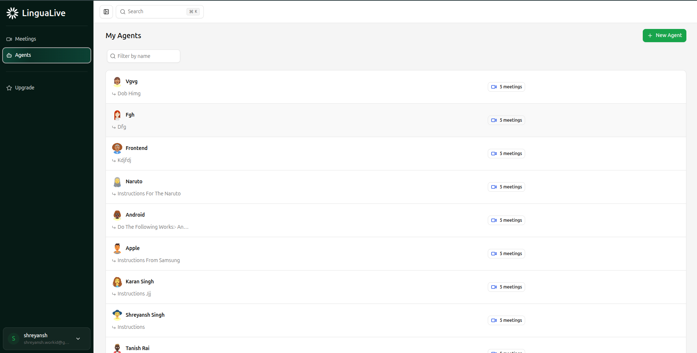

# TalkFlow

> AI-Powered Language Learning Platform - Practice pronunciation with personalized AI tutors and track your progress through interactive meetings.

## Overview

TalkFlow is a comprehensive language learning platform that combines AI-powered pronunciation feedback with an intuitive dashboard for managing learning sessions. Create custom AI tutors, schedule practice meetings, and get real-time feedback on your pronunciation using advanced speech recognition and AI technology.

## Features

- **Custom AI Tutors** - Create personalized language learning agents with custom instructions
- **Real-time Pronunciation Feedback** - Get instant feedback using OpenAI Whisper and Google Gemini
- **Meeting Management** - Schedule, track, and manage your learning sessions
- **Progress Tracking** - Monitor your improvement with detailed session analytics
- **User Authentication** - Secure login and user management system
- **Responsive Design** - Works seamlessly on desktop and mobile devices

## Tech Stack

### Frontend
- Next.js 15 with React 19
- TypeScript for type safety
- Tailwind CSS for styling
- Radix UI components
- Better Auth for authentication
- Drizzle ORM for database management

### Backend
- FastAPI for API development
- OpenAI Whisper for speech-to-text transcription
- Google Gemini for AI-powered feedback
- Python 3.12 with async support

## Prerequisites

- Node.js 18+ and npm
- Python 3.12+
- ffmpeg (for audio processing)

## Installation

1. **Clone the repository**
   ```bash
   git clone https://github.com/yourusername/TalkFlow.git
   cd TalkFlow
   ```

2. **Install dependencies**
   
   **Backend:**
   ```bash
   cd backend
   python3 -m venv venv
   source venv/bin/activate  # On Windows: venv\Scripts\activate
   pip install -r requirements.txt
   ```
   
   **Frontend:**
   ```bash
   cd web
   npm install
   ```

3. **Configure environment variables**
   
   Create a `.env` file in the root directory:
   ```bash
   GEMINI_API_KEY="your-gemini-api-key-here"
   WHISPER_MODEL="tiny"  # Options: tiny, base, small, medium, large
   ```

4. **Start the application**
   
   **Backend:**
   ```bash
   cd backend
   source venv/bin/activate
   python main.py
   ```
   
   **Frontend:**
   ```bash
   cd web
   npm run dev
   ```

5. **Access the application**
   - Main app: http://localhost:3000
   - Test recorder: http://localhost:3000/test-recorder

## How It Works

1. **Create an Account** - Sign up and create your profile
2. **Build AI Tutors** - Create custom language learning agents with specific instructions
3. **Schedule Meetings** - Plan practice sessions with your AI tutors
4. **Practice Pronunciation** - Record audio and receive real-time feedback
5. **Track Progress** - Monitor your improvement over time

## Getting Started

### Creating Your First AI Tutor
1. Navigate to the Agents section
2. Click "Create New Agent"
3. Provide a name and detailed instructions for your tutor
4. Save and start scheduling meetings

### Practicing Pronunciation
1. Go to your scheduled meeting
2. Click the microphone button to start recording
3. Speak clearly into your device
4. Stop recording to receive AI feedback
5. Review pronunciation tips and practice suggestions

## Configuration

### Whisper Models
Choose the right model for your needs:
- `tiny` - Fastest, good for testing
- `base` - Balanced speed and accuracy
- `small` - Better accuracy, slower
- `medium` - High accuracy, best for production
- `large` - Highest accuracy, requires more resources

### API Keys
- **Gemini API**: Get your free API key from [Google AI Studio](https://ai.google.dev/)
- **Rate Limits**: Free tier includes 15 requests per minute

## Screenshots

### Dashboard Overview


### AI Tutors Management


### Meetings & Sessions


### Sign In


### Sign Up


## Project Structure

```
TalkFlow/
├── backend/                 # FastAPI backend
│   ├── main.py             # Main server file
│   ├── requirements.txt    # Python dependencies
│   └── venv/              # Virtual environment
├── web/                    # Next.js frontend
│   ├── src/
│   │   ├── app/           # App router pages
│   │   ├── components/    # Reusable UI components
│   │   ├── modules/       # Feature modules
│   │   ├── lib/          # Utilities and configurations
│   │   └── db/           # Database schema
│   └── package.json
├── docs/                   # Documentation and screenshots
│   └── screenshots/       # UI screenshots
└── README.md
```

## Performance

- **Transcription Speed**: ~2-5 seconds for 10-second audio
- **API Response Time**: <500ms for feedback generation
- **Supported Audio Formats**: WebM, MP3, WAV
- **Browser Support**: Chrome, Firefox, Safari, Edge

## Contributing

We welcome contributions! Please follow these steps:

1. Fork the repository
2. Create a feature branch (`git checkout -b feature/amazing-feature`)
3. Commit your changes (`git commit -m 'Add amazing feature'`)
4. Push to the branch (`git push origin feature/amazing-feature`)
5. Open a Pull Request


## Acknowledgments

- [OpenAI Whisper](https://github.com/openai/whisper) for speech recognition
- [Google Gemini](https://ai.google.dev/) for AI-powered feedback
- [FastAPI](https://fastapi.tiangolo.com/) for the backend framework
- [Next.js](https://nextjs.org/) for the frontend framework


Start your language learning journey today!